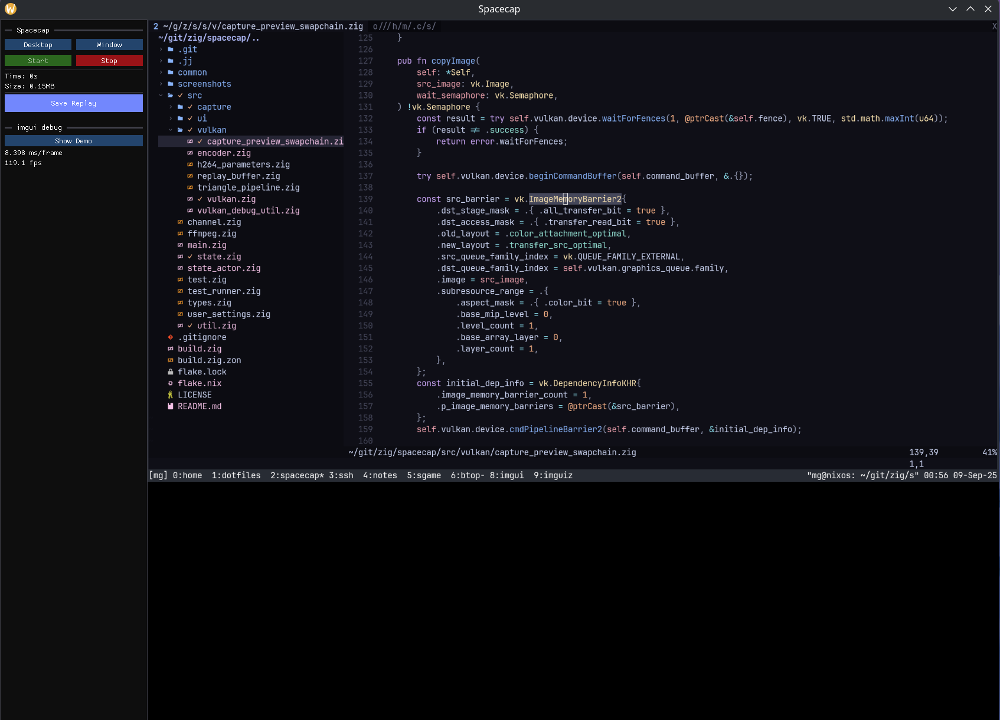

# Spacecap

A cross platform (Linux/Windows) screen recording tool focused on performance.

- Written in [Zig](https://ziglang.org/).
- Hardware encoding with Vulkan Video ([vulkan-zig](https://github.com/Snektron/vulkan-zig)).
- UI built with [imgui](https://github.com/ocornut/imgui).

### ⚠️ WARNING ⚠️

This is in the very early stages of development. Don't expect everything to work.

**What is currently working?**

**NOTE:** I'm testing with an RTX 3080 GPU. I have no idea if AMD works. I don't have one to test on.

- Linux
  - Select desktop/window.
  - Replay buffer with last 60 seconds of video (no audio yet).
  - Output to .mp4 file.
  - Global keybinds via desktop portal.
- Windows
  - Binaries are built for Windows, but capture has not been implemented yet (Linux is priority at the moment).

## How to compile and run

Currently this only works on Linux with [Nix](https://nixos.org/download/#download-nix).
A GPU that supports Vulkan Video is required.

```sh
nix develop
zig build run -Dnix
```

## Early Screenshot



## Roadmap

- Set up pipeline to build and distribute binaries.
  - Build for Flatpak.
- Audio recording.
- ~~Global keybinds~~
- Screenshots.
- ~~Show video preview on UI~~ - #9
  - Live scrubbing of video preview.
- Video Player.
  - Simple video editor (trim start/end).
- Convert video output (mp4, gif, etc.).
- Windows capture.

## Misc docs

Enable pipewire debug logs.

```sh
export PIPEWIRE_DEBUG=4
```
