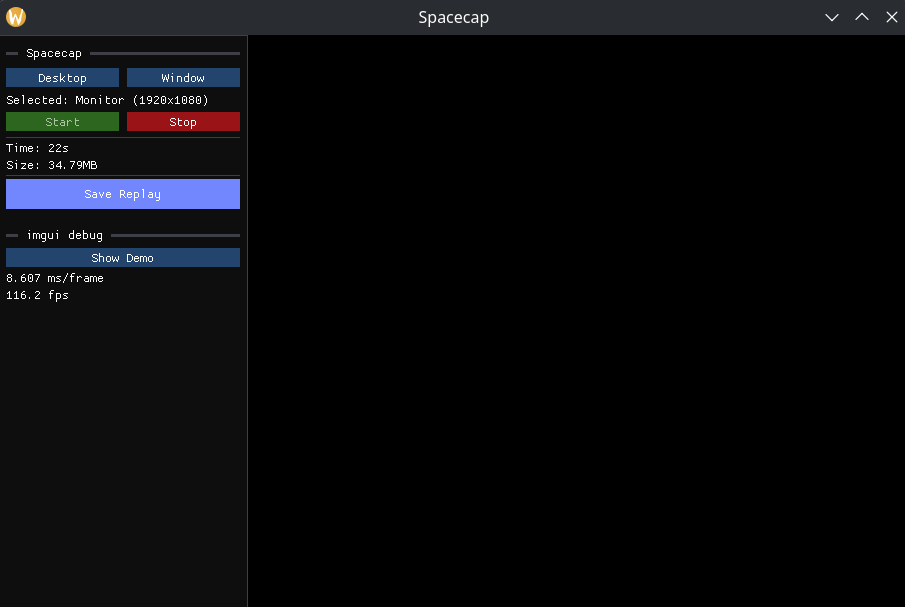

# Spacecap

An extremely fast, cross platform (Linux/Windows) screen recording tool focused on replays.

- written in [Zig](https://ziglang.org/)
- hardware encoding with Vulkan Video ([vulkan-zig](https://github.com/Snektron/vulkan-zig))
- UI built with [imgui](https://github.com/ocornut/imgui)

## ⚠️ WARNING ⚠️

This is in the very early prototype stages and is under heavy construction. Don't expect anything to work right away.

**What is currently working?**

- Linux
  - Select desktop/window
  - Record and save last 60 seconds (no audio yet)
- Windows
  - Binaries are built for Windows, but capture has not been implemented yet

## How to compile and run

Currently this only works on Linux with [Nix](https://nixos.org/download/#download-nix).
A GPU that supports Vulkan Video is required.

```sh
nix develop
zig build run -Dnix
```

## Early Screenshot



## Roadmap

- Audio recording
- Global keybinds
- Screenshots
- Show video preview on UI
  - Live scrubbing of video preview
- Video Player
  - Simple video editor (trim start/end)
- Convert video output (mp4, gif, etc.)
- AV1 encoding (Currently only H264 is supported)

## Misc docs

Enable pipewire debug logs

```sh
export PIPEWIRE_DEBUG=4
```
