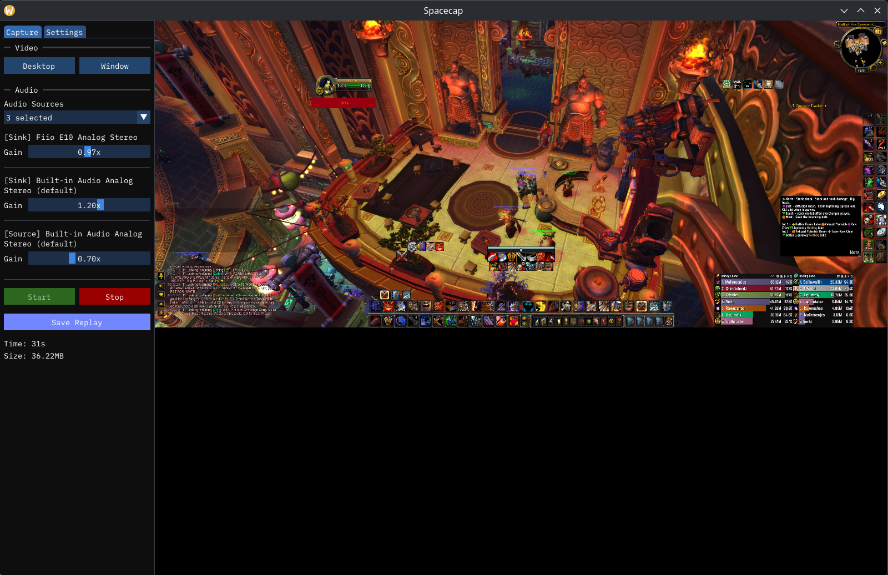

# Spacecap

A hardware accelerated replay capture tool focused on performance. Currently
only supports Linux.

This is currently in the very early stages of development.

- Written in [Zig](https://ziglang.org/).
- Hardware accelerated encoding with Vulkan Video ([vulkan-zig](https://github.com/Snektron/vulkan-zig)).
- UI built with [imgui](https://github.com/ocornut/imgui)/[SDL3](https://github.com/allyourcodebase/SDL3).

## Why you might want to use this?

You play games on Linux and are looking for a light weight and performant
alternative to OBS for capturing video replays.

## What currently is working?

- Linux
  - Select desktop/window.
  - Video capture preview on UI.
  - Replay buffer with last n seconds of video/audio.
  - Output to .mp4 file.
  - Global keybinds via desktop portal.
- Windows
  - Binaries are built for Windows, but capture has not been implemented yet.

**NOTE:** I'm testing with an RTX 3080 GPU. I have no idea if AMD works. I don't have one to test on.

## How to compile and run

Currently this only works on Linux with [Nix](https://nixos.org/download/#download-nix).
A GPU that supports Vulkan Video is required for recording.

```sh
# Build
nix develop -c zig build -Dnix

# Run
nix develop -c zig build run -Dnix

# Test
nix develop -c zig build test -Dnix
```

## Early Screenshot



## Roadmap

- Set up pipeline to build and distribute binaries (appimage).
- ~~Audio recording.~~
- ~~Global keybinds~~
- Screenshots.
- ~~Show video preview on UI~~ - #9
- Video Player.
  - Simple video editor (trim start/end).
- Convert video output (mp4, gif, etc.).
- ~~Linux capture.~~
- Windows capture.
