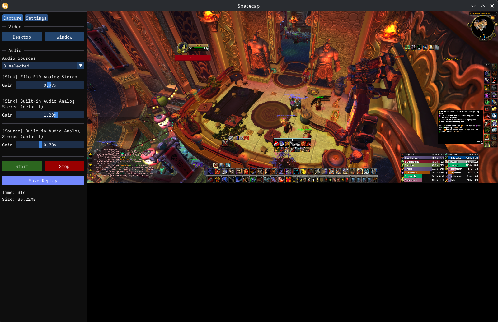

# Spacecap

A hardware accelerated replay capture tool focused on performance. Currently
only supports Linux.



<p align="center">(very early screenshot - UI still in development)</p>

- Written in [Zig](https://ziglang.org/).
- Hardware accelerated encoding with Vulkan Video ([vulkan-zig](https://github.com/Snektron/vulkan-zig)).
- UI built with [imgui](https://github.com/ocornut/imgui)/[SDL3](https://github.com/allyourcodebase/SDL3).

## Features

- Desktop/window capture
- Save last n seconds of video
- Global keybinds

## Why you might want to use this?

You play games on Linux and are looking for a lightweight and performant
alternative to OBS for capturing video replays.

## Requirements

- GPU that supports Vulkan Video

### Linux

- vulkan
- pipewire
- pipewire-pulse

#### Global Keybinds

If your version of Linux supports [xdg-desktop-portal global shortcuts](https://wiki.archlinux.org/title/XDG_Desktop_Portal#List_of_backends_and_interfaces) then you can configure it that way.
Otherwise, the Spacecap CLI can be used to send commands to the IPC server.

For example, here is what a config in [niri](https://github.com/YaLTeR/niri) would look like:

```kdl
binds {
    Mod+Shift+R hotkey-overlay-title="Spacecap: save replay" { spawn-sh "spacecap -s save-replay && notify-send 'Spacecap' 'Replay saved'"; }
}
```

Use `spacecap -h` to see available commands.

### Windows

Windows is not yet supported. This application was architected in such a way
that it can be cross platform. For Windows support, the audio/video capture
interfaces need to be implemented.

## Development

[Nix](https://nixos.org/download/#download-nix) is required for development,
unless you want to install all dependencies manually. See `flake.nix` if you'd
like to do so.

```sh
# Build
nix develop -c zig build -Dnix

# Run
nix develop -c zig build run -Dnix

# Test
nix develop -c zig build test -Dnix
```

## Roadmap

- ~~Set up pipeline to build and distribute binaries (appimage).~~
- ~~Audio recording.~~
- ~~Global keybinds~~
- Screenshots.
- ~~Show video preview on UI~~ - #9
- Video Player.
  - Simple video editor (trim start/end).
- Convert video output (mp4, gif, etc.).
- ~~Linux capture.~~
- Windows capture.
