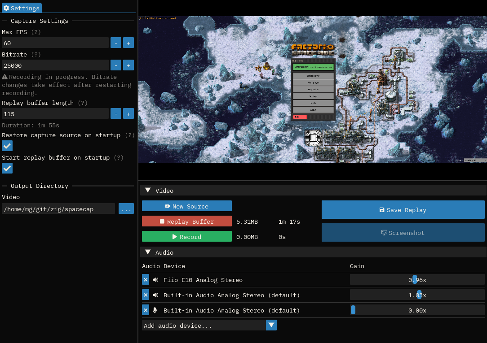

<p align="center">
    
</p>
<h1 align="center">Spacecap</h1>

A hardware accelerated screen recording/replay application focused on performance.
Currently only supports Linux. Still in early development (see roadmap below).

- Written in [Zig](https://ziglang.org/).
- Video encoding with Vulkan Video ([vulkan-zig](https://github.com/Snektron/vulkan-zig)).
- UI built with [imgui](https://github.com/ocornut/imgui)/[SDL3](https://github.com/allyourcodebase/SDL3).
- Muxing/Audio encoding with [FFmpeg](https://www.ffmpeg.org/).

---



## Installation

```sh
# Install
curl -LsSf https://spacecap.org/install | sh

# Uninstall
curl -LsSf https://spacecap.org/install | sh -s -- --uninstall
```

## Features

- Desktop/window capture.
- Screen recording.
- Replay buffer - save last n seconds of video (buffered in memory).
- Capture preview.
- Global keybinds.

## Roadmap

- Screenshots.
- Video player/editor.
  - Simple video editor (trim start/end).
  - File browser to select videos to edit.
- Additional video output formats (mp4, mov, mkv, gif, etc.).
- Windows support.

## Requirements

- A GPU that supports Vulkan Video.

**NOTE:** Only tested on an Nvidia GPU (RTX 3080) so far. AMD will be supported, I just
have no way of testing at this time.

### Linux

- vulkan
- pipewire
- pipewire-pulse

#### Global Keybinds

If your version of Linux supports [xdg-desktop-portal global shortcuts](https://wiki.archlinux.org/title/XDG_Desktop_Portal#List_of_backends_and_interfaces)
then they can be configured that way. Alternatively, Spacecap runs an IPC
server, which can be communicated with via Spacecap CLI.

For example, here is what a config in [niri](https://github.com/YaLTeR/niri) would look like:

```kdl
binds {
    Mod+Shift+R hotkey-overlay-title="Spacecap: save replay" { spawn-sh "spacecap -s save-replay && notify-send 'Spacecap' 'Replay saved'"; }
}
```

Use `spacecap -h` to see available commands.

### Windows

Windows is not yet supported. Spacecap is architected in such a way
that it can be cross platform. For Windows support, the audio/video capture
interfaces need to be implemented. It's on the roadmap, but is not currently
a priority.

## Development

[Nix](https://nixos.org/download/#download-nix) is required for development,
unless you want to install all dependencies manually. See `flake.nix` if you'd
like to do so.

```sh
# Build
nix develop -c zig build -Dnix

# Run
nix develop -c zig build run -Dnix

# Test
nix develop -c zig build test -Dnix
```

## Logging

By default, Spacecap only writes error logs to `error.log`. Set the
`SPACECAP_LOG_LEVEL` environment variable to one of the following to change this
behavior:

- debug
- info
- warning
- error

Crash logs are written to `crash.log`. This happens when a panic occurs.

#### Log Location

- **Linux**: `$XDG_CONFIG_HOME/spacecap`, or `$HOME/.config/spacecap`
- **Windows**: `%APPDATA%\spacecap`.

## Troubleshooting

### Linux restore capture source stops working

Spacecap uses the XDG desktop portal screencast permission store to restore the
previous capture source. If the portal permission database gets corrupted,
restore may stop working even after selecting a source again. This has happened
to me after my main disk filled up unexpectedly.

To reset only the screencast portal permissions, delete the database and then
reboot.

```sh
# Delete
rm ~/.local/share/flatpak/db/screencast ~/.local/share/flatpak/db/screencast.bak

# OR move it to a backup
mv ~/.local/share/flatpak/db/screencast ~/.local/share/flatpak/db/screencast.bak

reboot
```
