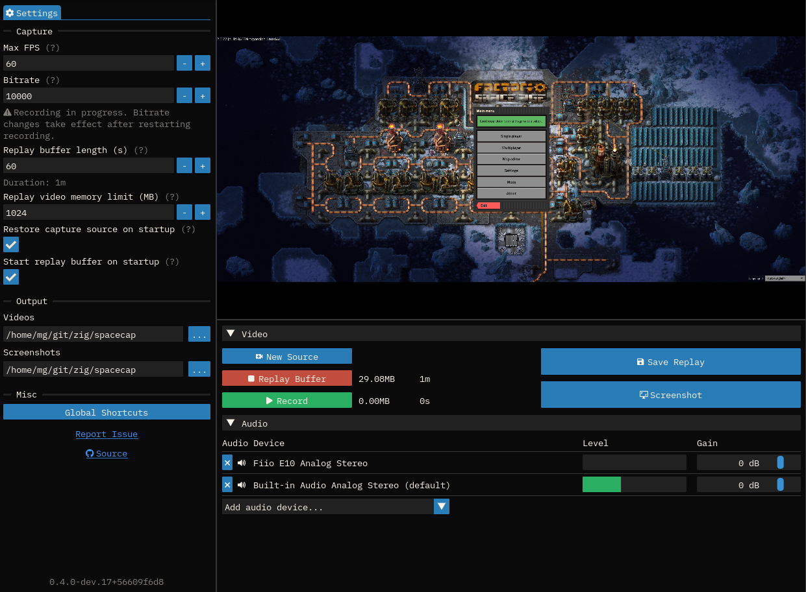

<p align="center">
    
</p>
<h1 align="center">Spacecap</h1>

High performance screen recording software for Linux. _Still pre-alpha (see features/roadmap below)_.

- Written in [Zig (0.17.0)](https://ziglang.org/)
- Video encoding with Vulkan Video ([vulkan-zig](https://github.com/Snektron/vulkan-zig))
- UI built with [imgui](https://github.com/ocornut/imgui) and [SDL3](https://github.com/allyourcodebase/SDL3)
- Muxing/Audio encoding with [FFmpeg](https://www.ffmpeg.org/)



## Installation

```sh
# Spacecap will be installed to ~/.local/bin/spacecap

# Install the latest stable release
curl -LsSf https://spacecap.org/install | sh

# Install the latest nightly build, which is in sync with main
curl -LsSf https://spacecap.org/install | sh -s -- --nightly

# Uninstall
curl -LsSf https://spacecap.org/install | sh -s -- --uninstall
```

## Features

- Replay buffer (in memory)
- Recording
- Screenshots
- Global keybinds
- Desktop/window capture
- Capture preview

## Roadmap

- File browser
- Video editor
  - Trim clips
  - Export in a variety of formats
  - Adjust audio levels
- Windows support

## Requirements

- A GPU that supports Vulkan Video encoding

**NOTE:** So far this has only been tested on an Nvidia GPU (RTX 3080). AMD will
be supported, I just have no way of testing at this time.

### Linux

- Wayland
- Pipewire
- Updated graphics drivers (e.g. nvidia-open)

### Windows

- Windows is not yet supported. Spacecap is architected in such a way that it
  can be cross platform. For Windows support, the audio/video capture interfaces
  need to be implemented. It's on the roadmap, but is not currently a priority.

## Global Keybinds

### Linux

#### KDE, GNOME, etc.

Shortcuts can be configured in your system settings.
Spacecap configures global shortcuts via the XDG Desktop Portal. [See the list of supported desktop environments here.](https://wiki.archlinux.org/title/XDG_Desktop_Portal#List_of_backends_and_interfaces)

#### Other Compositors

The Spacecap CLI can be used to send commands:

```sh
spacecap -s save-replay
```

See all available commands:

```sh
spacecap -h
```

Niri

```kdl
binds {
  Mod+Shift+R { spawn-sh "spacecap -s save-replay"; }
}
```

Hyprland

```lua
hl.bind(
  "SUPER + SHIFT + R",
  hl.dsp.exec_cmd("spacecap -s save-replay")
)
```

## Development

[Nix](https://nixos.org/download/#download-nix) is required for development.

```sh
# Build
nix develop -c zig build -Dnix

# Run
nix develop -c zig build run -Dnix

# Test
nix develop -c zig build test -Dnix
```

## Logging

By default, Spacecap only writes error logs to `error.log`. Set the
`SPACECAP_LOG_LEVEL` environment variable to `debug`, `info`, `warning`, or
`error`.

Crash logs are written to `crash.log`, which happens when a panic occurs.

#### Log Location

- **Linux**: `$XDG_CONFIG_HOME/spacecap`, or `$HOME/.config/spacecap`
- **Windows**: `%APPDATA%\spacecap`.

## Troubleshooting

### Linux restore capture source stops working

Spacecap uses the XDG desktop portal screencast permission store to restore the
previous capture source. If the portal permission database gets corrupted,
restore may stop working even after selecting a source again. This has happened
to me after my main disk filled up unexpectedly.

To reset only the screencast portal permissions, delete the database and then
reboot.

```sh
# Delete
rm ~/.local/share/flatpak/db/screencast

# OR move it to a backup
mv ~/.local/share/flatpak/db/screencast ~/.local/share/flatpak/db/screencast.bak

reboot
```
